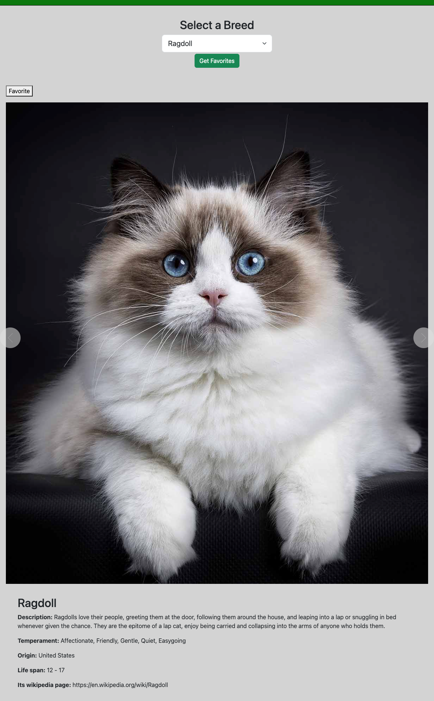

## Cat API Website

This project utilizes the Cat API to display information and images of different cat breeds. Users can select a breed from a dropdown menu, and the website dynamically loads images and information related to the selected breed.

### Technologies Used
- JavaScript
- Axios for HTTP requests
- Bootstrap for styling (only grid system utilized)
- HTML and CSS

### Files
- **index.js**: Contains the main JavaScript logic for fetching breed data, handling user interactions, and managing favorites.
- **Carousel.js**: Contains utility functions for creating and managing the carousel of images.
- **index.html**: HTML markup for the webpage layout.
- **styles.css**: CSS styles for the webpage.

### How to Run
1. Clone the repository to your local machine.
2. Open the `index.html` file in a web browser.

### Features
1. Breed Selection: Users can select a cat breed from a dropdown menu.
2. Carousel: Images of the selected breed are displayed in a carousel format, allowing users to navigate through them.
3. Breed Information: Information about the selected breed, including description, temperament, origin, and lifespan, is displayed below the carousel.
4. Favorite Images: Users can favorite images by clicking the heart icon. Favorited images are stored locally and can be accessed later.
5. Get Favorites: Users can view their favorited images by clicking the "Get Favorites" button. This button clears the carousel and displays only favorited images.

### Functionality
- **Initial Load**: When the webpage loads, it fetches a list of cat breeds from the Cat API and populates the dropdown menu.
- **Breed Selection**: Upon selecting a breed from the dropdown menu, the webpage fetches images and information about the selected breed.
- **Carousel**: Images of the selected breed are displayed in a carousel, allowing users to navigate through them using previous and next buttons.
- **Favorite Images**: Users can favorite images by clicking the heart icon. Favorited images are stored locally using browser localStorage.
- **Get Favorites**: Clicking the "Get Favorites" button displays favorited images in the carousel, clearing any existing images.

### Testing
- **Malayan Breed**: Verify that loading the Malayan breed displays images and information correctly.
- **Other Breeds**: Test various cat breeds to ensure the website handles different data and breeds effectively.

By following these instructions, you can run the Cat API website and explore information and images of various cat breeds. Enjoy exploring the wonderful world of cats!
